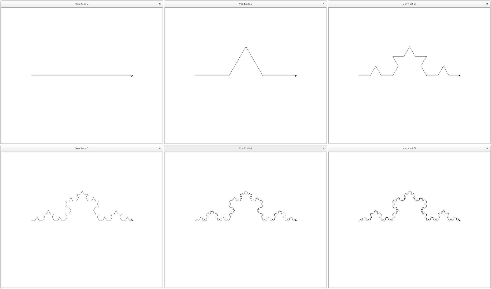
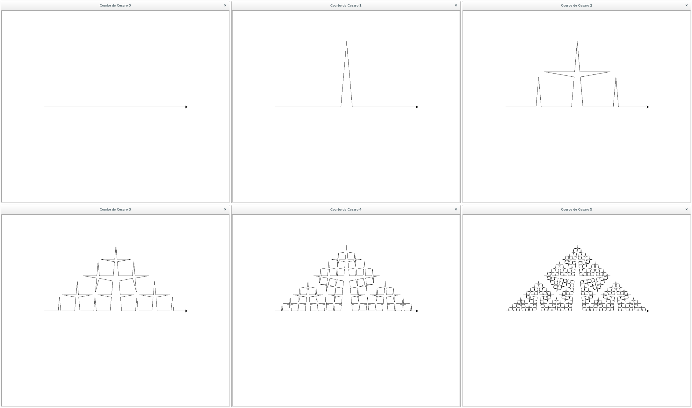

=================
Drawing fractals
=================

Von Koch curve
==============

.. _fig:all_von_koch:

Cesaro curve
============

.. _fig:all_cesaro:

Sierpinski triangle
===================

.. _fig:all_sierpinski:
.. figure:: images/all_sierpinsli.png
   :align: center
   :width: 50%
   :alt: la courbe de Sierpinski de l'ordre 0 à l'ordre 5
