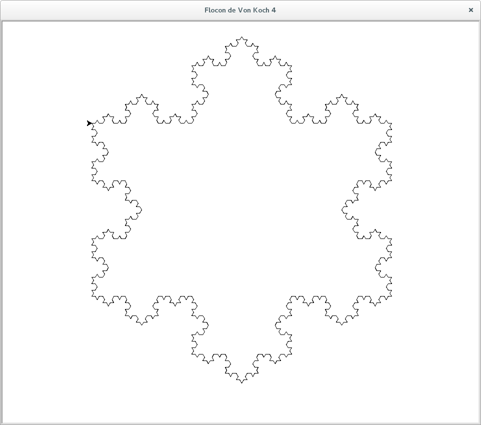
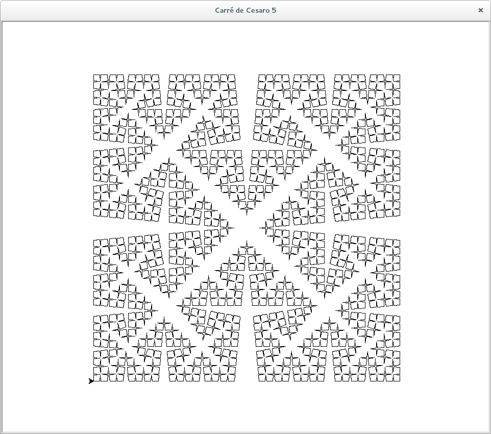
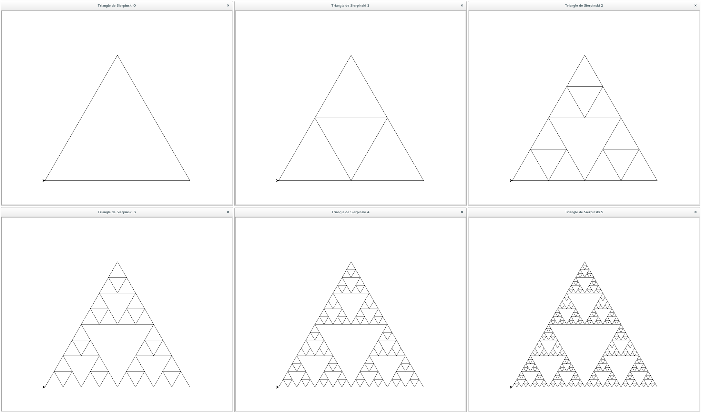

=================
Drawing fractals
=================

Von Koch curve
==============

.. _fig:all_von_koch:
.. figure:: images/all_von_koch.png
   :align: center
   :width: 50%
   :alt: la courbe de Von Koch de l'ordre 0 à l'ordre 5

.. literalinclude:: ../src/fractals.py
   :language: python
   :pyobject: von_koch
   :linenos:

Von Koch snowflake
==================

.. _fig:von_koch_snowflake:

   
.. literalinclude:: ../src/fractals.py
   :language: python
   :pyobject: von_koch_flocon
   :linenos:   
Cesaro curve
============

.. _fig:all_cesaro:
.. figure:: images/all_cesaro.png
   :align: center
   :width: 50%
   :alt: la courbe de Cesaro de l'ordre 0 à l'ordre 5

.. literalinclude:: ../src/fractals.py
   :language: python
   :pyobject: cesaro
   :linenos:

Cesaro square
=============
   
.. _fig:cesaro_square:

   
.. literalinclude:: ../src/fractals.py
   :language: python
   :pyobject: cesaro_carre
   :linenos:   
   
Sierpinski triangle
===================

.. _fig:all_sierpinski:

   
.. literalinclude:: ../src/fractals.py
   :language: python
   :pyobject: sierpinski
   :linenos:   
